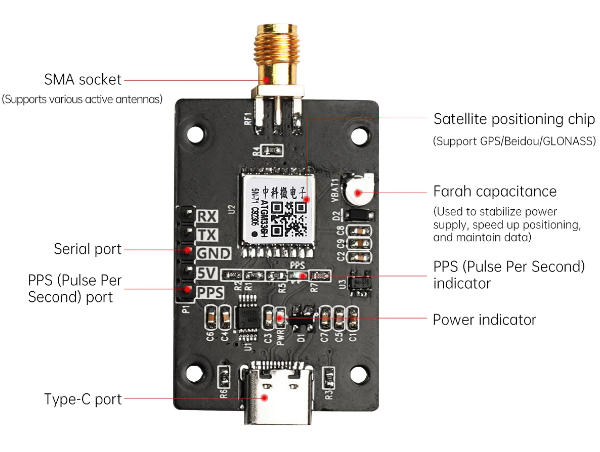
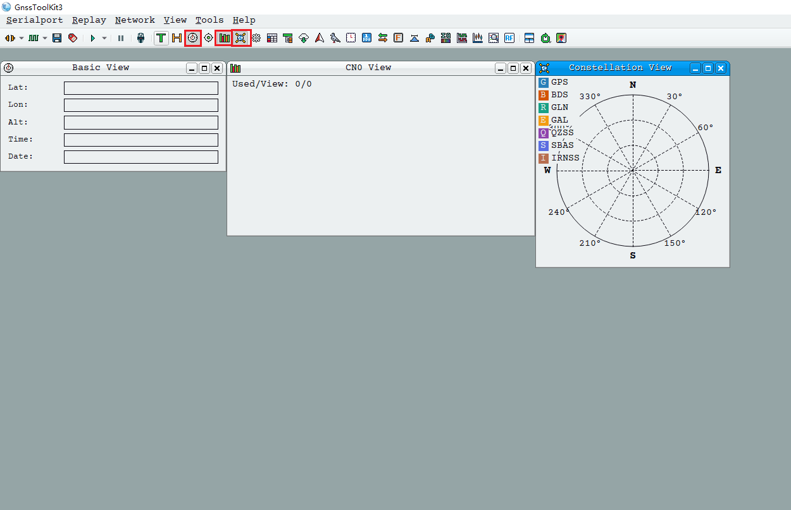
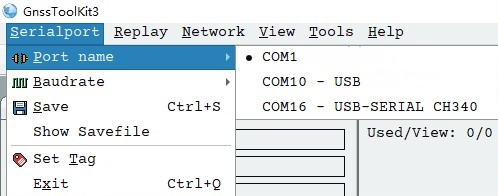
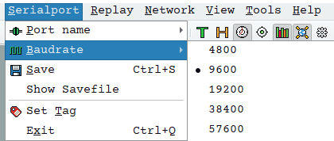

# 1. User Manual

## 1.1 GPS Module Introduction

The GPS module is a high-performance BDS/GNSS positioning and navigation module based on `ATGM336H-5N`. This module supports a variety of satellite navigation systems, including all of China's Beidou-2 and Beidou-3 satellites, the United States' GPS, Russia's GLONASS, and Japan's QZSS. It is capable of simultaneously receiving satellite signals from these navigation systems, enabling joint positioning, navigation, and guidance. Additionally, the module offers advantages such as high sensitivity, low power consumption, and low cost, making it suitable for various applications including vehicle navigation, handheld positioning, and wearable devices.

### 1.1.1 Module Feature

(1) Supports all Beidou-2 and Beidou-3 satellites (Satellites 1~63)

(2) Supports single system positioning of BDS/GPS/QZSS satellite navigation system, as well as any combination of multi-system joint positioning

(3) Supports A-GNSS

(4) Cold start capture sensitivity: -148dBm

(5) Tracking sensitivity: -162dBm

(6) Positioning accuracy: 2.5 meters (CEP50)

(7) First positioning time: 32 seconds

(8) Low power consumption: continuous operation at 25mA@3.3V

(9) Built-in antenna detection and antenna short circuit protection function

### 1.1.2 Interface Diagram

### 1.1.3 Communication Protocol

To access the details about the communication protocol, please refer to the PDF file saved in [Protocol Specification for CASIC Multi-Mode Satellite Navigation Receivers](Appendix.md).

## 1.2 PC Software Use Instructions

### 1.2.1 Open the Software

Extract the [GnssToolKit3.zip](Appendix.md) to the local disk.

Navigate to the folder [Appendix](Appendix.md) and, double-click [GnssToolKit3.exe](Appendix.md)   to open the software. Upon entering the interface, begin by selecting three icons: one for displaying the satellite position view, another for the basic view, and the third for the carrier-to-noise ratio view. This setup will facilitate real-time monitoring of satellites, star data, and corresponding effects.

### 1.2.2 Connect to Receiver

To power on the receiver, connect the computer's serial port to the receiver's serial port using a serial port cable. If you are using a USB to serial port cable and encounter random data transmission issues, please follow these steps: disconnect the receiver's power, open the USB serial port using appropriate software, then power on the receiver. When converting from USB to a serial port chip, be aware that garbled characters in serial port communication may occur, potentially causing system startup errors.

### 1.2.3 Serial Port Setting

Click-on the **"Serial Port"** option to configure the serial port.

* **Serial Port Configuration**

When configuring the serial port name, selecting **"Serial port name"** will display all serial ports available in the system. If the serial port number font appears gray (e.g., `COM7`), it indicates that the serial port device is busy and cannot be accessed by the program, possibly due to occupation by other processes. To establish a connection between the software and the receiver, simply click on the serial port number corresponding to the receiver.

(1) Baud Rate Configuration

To configure the baud rate, select the **"Baud rate"** menu item to view the valid baud rates for the receiver. The default baud rate is 9600. Users should select the appropriate baud rate according to the receiver's specifications. It is crucial for the software to function properly with the receiver.

(2) Communication

If unsure about the receiver's baud rate, users can open the NMEA view in the View menu and try each baud rate individually. If a readable navigation message appears in the NMEA view, it indicates that the current baud rate selection is consistent with the receiver's baud rate.

(3) Serial Port Status

The software's bottom status bar includes an indicator light for the serial port status. An illuminated icon indicates that the serial port is open, while a grayed-out icon indicates that the serial port is closed. If the serial port indicator light flashes, it indicates active data communication through the serial port.