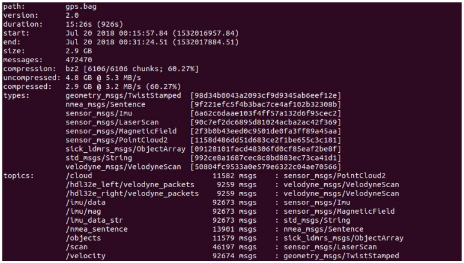
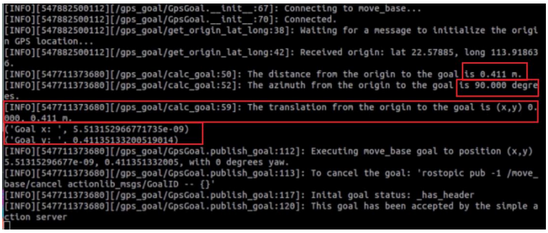

# 2. GPS Routine Analysis

## 2.1 STC51 Parsing Routine

This procedure utilizes the `STC51` series chip development board, which will be referred to as `C51` for demonstration purposes. The necessary equipment includes `Win10` or `Win11` computers, GPS modules (with wired data interface), `micro-USB` data cables, `CH340` modules, and `DuPont` cables.

### 2.1.1 Preparation

The GPS module supports `UART` and `USB` communication, and the `UART` port of `C51` board will be used to retrieve the information. Connect the `TX` pin to the `P3.0` pin of the `C51` board, `VCC` to `5V`, and `GND` to `GND`. Additionally, connect the `STM32` controller to the computer's `USB` port using the `micro-USB` data cable to provide power.


### 2.1.2 Case Development

[Source Code](https://drive.google.com/drive/folders/1cmUI89No4YHP3FWjTXU3UPGBmBpcnxNg?usp=sharing)

In this procedure, the baud rate for serial port printing is set to `9600bps`, and the baud rate for the serial port connection between GPS and `STC51` is also set to `9600bps`.

* **Initialize the serial port and data array**

{lineno-start=15}
```c
void main()
{
	unsigned char i = 0;
	Uart_Init();
	Delay_ms(10);

	UartPrintf("Welcome to use!");

	clrStruct();
```

* **Read and parse the received data**

{lineno-start=45}
```c
void parseGpsBuffer()
{
	char *subString;
	char *subStringNext;
	char i = 0;
	if (Save_Data.isGetData)
	{
		Save_Data.isGetData = false;
		UartPrintf("**************\r\n");
		UartPrintf(Save_Data.GPS_Buffer);

		
		for (i = 0 ; i <= 6 ; i++)
		{
			if (i == 0)
			{
				if ((subString = strstr(Save_Data.GPS_Buffer, ",")) == NULL)
					errorLog(1);
			}
			else
			{
				subString++;
				if ((subStringNext = strstr(subString, ",")) != NULL)
				{
					char usefullBuffer[2];
					switch(i)
					{
						case 1:memcpy(Save_Data.UTCTime, subString, subStringNext - subString);break;
						case 2:memcpy(usefullBuffer, subString, subStringNext - subString);break;
						case 3:memcpy(Save_Data.latitude, subString, subStringNext - subString);break;
						case 4:memcpy(Save_Data.N_S, subString, subStringNext - subString);break;
						case 5:memcpy(Save_Data.longitude, subString, subStringNext - subString);break;
						case 6:memcpy(Save_Data.E_W, subString, subStringNext - subString);break;

						default:break;
					}

					subString = subStringNext;
					Save_Data.isParseData = true;
					if(usefullBuffer[0] == 'A')
						Save_Data.isUsefull = true;
					else if(usefullBuffer[0] == 'V')
						Save_Data.isUsefull = false;

				}
				else
				{
					errorLog(2);
				}
			}
```

* **Print the received data through serial port**

{lineno-start=101}
```c
void printGpsBuffer()
{
	if (Save_Data.isParseData)
	{
		Save_Data.isParseData = false;
		
		UartPrintf("Save_Data.UTCTime = ");
		UartPrintf(Save_Data.UTCTime);
		UartPrintf("\r\n");

		if(Save_Data.isUsefull)
		{
			Save_Data.isUsefull = false;
			UartPrintf("Save_Data.latitude = ");
			UartPrintf(Save_Data.latitude);
			UartPrintf("\r\n");


			UartPrintf("Save_Data.N_S = ");
			UartPrintf(Save_Data.N_S);
			UartPrintf("\r\n");

			UartPrintf("Save_Data.longitude = ");
			UartPrintf(Save_Data.longitude);
			UartPrintf("\r\n");

			UartPrintf("Save_Data.E_W = ");
			UartPrintf(Save_Data.E_W);
			UartPrintf("\r\n");
		}
		else
		{
			UartPrintf("GPS DATA is not usefull!\r\n");
		}
		
	}
}
```

### 2.1.3 Program Outcome

After the module is powered on, it takes approximately 32 seconds to initialize. Subsequently, the serial port printing status light on the module will continuously flash, indicating normal data reception. Once the program is downloaded and executed, open the serial port software and configure the baud rate to 9600. The serial port will then continuously print the current position information in a loop.


:::{Note}
For optimal performance, ensure that the module antenna is positioned outdoors. Inadequate signal reception may occur if the antenna is not placed outdoors.
:::

## 2.2 STM32 Parsing Routine

This procedure utilizes the `STM32F103C8T6` chip development board, referred to as `STM32` for demonstration purposes. The required equipment includes `Win10` or `Win11` computers, GPS modules (with pre-wired data interface), `micro-USB` data cable, `CH340` module, and several `DuPont` cables.

### 2.2.1 Preparation

The GPS module utilizes `UART` and `USB` communication. In this setup, the `UART` port of the `STM32` is employed to retrieve information. Specifically, the module's `TXD` is connected to the `PA10` pin of the `STM32F103C8T6` board, while `VCC` and `GND` are connected to the `5V` and `GND` pins of the `STM32F103C8T6` board, respectively. Additionally, the `GND` and `RXD` of the `TTL` module are connected to the `GND` and `PA9` pins of the `STM32`, respectively.


To connect the `STM32` to the `TTL` serial port assistant, you only need to make the following connections:

**STM32 	GPS**

PA10 <------ TXD

**STM32USB-TTL module**

 3.3V  ------>   3.3V

 GND  ------> GND

 PA9   ------>   RXD


### 2.2.2 Case Development

[Source Code](https://drive.google.com/drive/folders/1cmUI89No4YHP3FWjTXU3UPGBmBpcnxNg?usp=sharing)

In this procedure, the baud rate for serial port printing is set to `9600bps`, and the baud rate for the serial port connection between GPS and `STM32` is also set to `9600bps`.

* **Initialize the serial port and data array**

{lineno-start=30}
```c
	uart_init(9600); 
```

* **Read and parse the received data**

{lineno-start=53}
```c
void parseGpsBuffer()
{
	char *subString;
	char *subStringNext;
	char i = 0;
	if (Save_Data.isGetData)
	{
		Save_Data.isGetData = false;
		printf("**************\r\n");
		printf(Save_Data.GPS_Buffer);

		
		for (i = 0 ; i <= 6 ; i++)
		{
			if (i == 0)
			{
				if ((subString = strstr(Save_Data.GPS_Buffer, ",")) == NULL)
					errorLog(1);
			}
			else
			{
				subString++;
				if ((subStringNext = strstr(subString, ",")) != NULL)
				{
					char usefullBuffer[2]; 
					switch(i)
					{
						case 1:memcpy(Save_Data.UTCTime, subString, subStringNext - subString);break;
						case 2:memcpy(usefullBuffer, subString, subStringNext - subString);break;
						case 3:memcpy(Save_Data.latitude, subString, subStringNext - subString);break;
						case 4:memcpy(Save_Data.N_S, subString, subStringNext - subString);break;
						case 5:memcpy(Save_Data.longitude, subString, subStringNext - subString);break;
						case 6:memcpy(Save_Data.E_W, subString, subStringNext - subString);break;

						default:break;
					}

					subString = subStringNext;
					Save_Data.isParseData = true;
					if(usefullBuffer[0] == 'A')
						Save_Data.isUsefull = true;
					else if(usefullBuffer[0] == 'V')
						Save_Data.isUsefull = false;

				}
				else
				{
					errorLog(2);
				}
			}
```

* **Convert the latitude and longitude information into degrees**

{lineno-start=108}
```c
double Convert_to_degrees(char* data)
{
	double temp_data = atof(data);
	int degree = (int)(temp_data / 100);
	double f_degree = (temp_data / 100.0 - degree)*100/60.0;
	double result = degree + f_degree;
	return result;
}

```

* **Print the received data through serial port**

{lineno-start=118}
```c
void printGpsBuffer()
{
	double f_latitude = 0.0;
	double f_longitude = 0.0;
	
	if (Save_Data.isParseData)
	{
		Save_Data.isParseData = false;
		
		printf("Save_Data.UTCTime = ");
		printf(Save_Data.UTCTime);
		printf("\r\n");

		if(Save_Data.isUsefull)
		{
			Save_Data.isUsefull = false;
			printf("Save_Data.latitude = ");
			// printf(Save_Data.latitude);
			// printf("--");
			f_latitude = Convert_to_degrees(Save_Data.latitude);
			printf("%lf%s", f_latitude, Save_Data.N_S);
			printf("\r\n");

			printf("Save_Data.N_S = ");
			printf(Save_Data.N_S);
			printf("\r\n");

			printf("Save_Data.longitude = ");
			// printf(Save_Data.longitude);
			// printf("--");
			f_longitude = Convert_to_degrees(Save_Data.longitude);
			printf("%lf%s", f_longitude, Save_Data.E_W);
			printf("\r\n");

			printf("Save_Data.E_W = ");
			printf(Save_Data.E_W);
			printf("\r\n");
		}
		else
		{
			printf("GPS DATA is not usefull!\r\n");
		}
		
	}
```

### 2.2.3 Program Outcome

After the module is powered on, it takes approximately 32 seconds to initialize. Subsequently, the serial port printing status light on the module will continue to flash, indicating normal data reception. Once the program is downloaded and executed, open the serial port software, set the baud rate to 9600, and the serial port will continuously print the current location information in a loop.

* **F103**


* **F407**


:::{Note}
For optimal performance, ensure that the module antenna is positioned outdoors. Inadequate signal reception may occur if the antenna is not placed outdoors.
:::

## 2.3 Arduino Reading Routine

This procedure utilizes the `Arduino UNO` development board, referred to as `Arduino` for demonstration purposes. The required equipment includes `Win10` or `Win11` computers, GPS modules (with pre-wired data interface), `micro-USB` data cables, `CH340` modules, and `DuPont` cables.

### 2.3.1 Preparation

The GPS module utilizes `UART` and `USB` communication. In this setup, the `UART` port of the `Arduino UNO` is used to read information, with the module's `TX` connected to the `DO` pin of the `Arduino UNO` board. Additionally, `VCC` and `GND` are connected to the `5V` and `GND` pins, respectively, of the `Arduino UNO` board.


### 2.3.2 Case Development

* **Program Analysis**

[Source Code](https://drive.google.com/drive/folders/1cmUI89No4YHP3FWjTXU3UPGBmBpcnxNg?usp=sharing)

In this procedure, the baud rate for serial port printing is set to `9600bps`, and the baud rate for the serial port connection between GPS and `Arduino` is also set to `9600bps`.

(1) Initialize the serial port and data array

{lineno-start=5}
```c
void setup()
{
  GPSSerial.begin(9600);		
  DEBUGSerial.begin(9600);  
}
```

(2) Print the received data

{lineno-start=11}
```c
void loop()	
{
  while (GPSSerial.available()) {   
     DEBUGSerial.write(GPSSerial.read()); 
  }
```

* **Compile the Downloaded Program**

(1) To compile the program, we require the Arduino IDE software. Open the file using the Arduino IDE, then navigate to the menu bar and click on . Wait until you see the message **"Compilation Successful"** appear in the lower left corner.


(2) In the menu bar of the Arduino IDE, navigate to `[Tools] -> [Port]`(), and then select the port number that corresponds to the one displayed in the device manager, as illustrated in the following figure:


(3) After selection, click-on  to upload the code to the UNO board. When the programs are uploaded successfully, you will receive the prompt at the lower left corner.


### 2.3.3 Program Outcome

After the module is powered on, it takes approximately 32 seconds to initialize. Subsequently, the `PPS` (pulse per second) blue indicator light on the module will continue to flash, indicating normal data reception.

Once the program is downloaded and executed, open the serial port monitoring window and the serial port software. Set the baud rate to 9600. The serial port will then cyclically print the current position information.

It's important to note that this information is unprocessed original data. For further details, you can refer to the `CASIC` multi-mode satellite receiver protocol specification document.


:::{Note}
For optimal performance, ensure that the module antenna is positioned outdoors. Inadequate signal reception may occur if the antenna is not placed outdoors.
:::

## 2.4 Arduino Parsing Routine

This procedure utilizes the `Arduino UNO` development board, which will be referred to as `Arduino` for convenience. The required equipment includes `Win10` or `Win11` computers, GPS modules (with pre-wired data interface), `micro-USB` data cables, `CH340` modules, and `DuPont` cables.

### 2.4.1 Preparation

The GPS module utilizes `UART` and `USB` communication. In this setup, the `UART` port of the `Arduino UNO` is used to read information, with the module's `TX` connected to the digital output (`DO`) pin of the `Arduino UNO` board. Additionally, `VCC` and `GND` are connected to the `5V` and `GND` pins, respectively, of the `Arduino UNO` board.


### 2.4.2 Case Development

* **Program Analysis**

[Source Code](https://drive.google.com/drive/folders/1cmUI89No4YHP3FWjTXU3UPGBmBpcnxNg?usp=sharing)

In this procedure, the baud rate for serial port printing is set to `9600bps`, and the baud rate for the serial port connection between GPS and `Arduino` is also set to `9600bps`.

(1) Initialize the serial port and data array

{lineno-start=24}
```c
void setup()
{
	GpsSerial.begin(9600);		
	DebugSerial.begin(9600);

	Save_Data.isGetData = false;
	Save_Data.isParseData = false;
	Save_Data.isUsefull = false;
}
```

(2) Read the date of serial port

{lineno-start=140}
```c
void gpsRead() {
	while (GpsSerial.available())
	{
		gpsRxBuffer[ii++] = GpsSerial.read();
		if (ii == gpsRxBufferLength)clrGpsRxBuffer();
	}

	char* GPS_BufferHead;
	char* GPS_BufferTail;
	if ((GPS_BufferHead = strstr(gpsRxBuffer, "$GPRMC,")) != NULL || (GPS_BufferHead = strstr(gpsRxBuffer, "$GNRMC,")) != NULL )
	{
		if (((GPS_BufferTail = strstr(GPS_BufferHead, "\r\n")) != NULL) && (GPS_BufferTail > GPS_BufferHead))
		{
			memcpy(Save_Data.GPS_Buffer, GPS_BufferHead, GPS_BufferTail - GPS_BufferHead);
			Save_Data.isGetData = true;

			clrGpsRxBuffer();
		}
	}
}

```

(3) Parse the serial port data

{lineno-start=84}
```c
void parseGpsBuffer()
{
	char *subString;
	char *subStringNext;
	if (Save_Data.isGetData)
	{
		Save_Data.isGetData = false;
		DebugSerial.println("**************");
		DebugSerial.println(Save_Data.GPS_Buffer);

		
		for (int i = 0 ; i <= 6 ; i++)
		{
			if (i == 0)
			{
				if ((subString = strstr(Save_Data.GPS_Buffer, ",")) == NULL)
					errorLog(1);
			}
			else
			{
				subString++;
				if ((subStringNext = strstr(subString, ",")) != NULL)
				{
					char usefullBuffer[2]; 
					switch(i)
					{
						case 1:memcpy(Save_Data.UTCTime, subString, subStringNext - subString);break;
						case 2:memcpy(usefullBuffer, subString, subStringNext - subString);break;
						case 3:memcpy(Save_Data.latitude, subString, subStringNext - subString);break;
						case 4:memcpy(Save_Data.N_S, subString, subStringNext - subString);break;
						case 5:memcpy(Save_Data.longitude, subString, subStringNext - subString);break;
						case 6:memcpy(Save_Data.E_W, subString, subStringNext - subString);break;

						default:break;
					}

					subString = subStringNext;
					Save_Data.isParseData = true;
					if(usefullBuffer[0] == 'A')
						Save_Data.isUsefull = true;
					else if(usefullBuffer[0] == 'V')
						Save_Data.isUsefull = false;

```

(4) Print the parsed position info

{lineno-start=55}
```c
void printGpsBuffer()
{
	if (Save_Data.isParseData)
	{
		Save_Data.isParseData = false;
		
		DebugSerial.print("Save_Data.UTCTime = ");
		DebugSerial.println(Save_Data.UTCTime);

		if(Save_Data.isUsefull)
		{
			Save_Data.isUsefull = false;
			DebugSerial.print("Save_Data.latitude = ");
			DebugSerial.println(Save_Data.latitude);
			DebugSerial.print("Save_Data.N_S = ");
			DebugSerial.println(Save_Data.N_S);
			DebugSerial.print("Save_Data.longitude = ");
			DebugSerial.println(Save_Data.longitude);
			DebugSerial.print("Save_Data.E_W = ");
			DebugSerial.println(Save_Data.E_W);
		}
		else
		{
			DebugSerial.println("GPS DATA is not usefull!");
		}
		
	}
}
```

(1) Compile the Downloaded Program

① To compile the program, we require the Arduino IDE software. Open the file using the Arduino IDE, then navigate to the menu bar and click on . Wait until you see the message **"Compilation Successful"** appear in the lower left corner.


② In the menu bar of the Arduino IDE, navigate to `[Tools] -> [Port]`(), and then select the port number that corresponds to the one displayed in the device manager, as illustrated in the following figure:


③ After selection, click-on  to upload the code to the UNO board. When the programs are uploaded successfully, you will receive the prompt at the lower left corner.


### 2.4.3 Program Outcome

After the module is powered on, it takes approximately 32 seconds to initialize. Subsequently, the `PPS` (pulse per second) blue indicator light on the module will continue to flash, indicating normal data reception.

Once the program is downloaded and executed, open the serial port monitoring window and the serial port software. Set the baud rate to 9600. The serial port will then cyclically print parsed real-time location information.


:::{Note}
For optimal performance, ensure that the module antenna is positioned outdoors. Inadequate signal reception may occur if the antenna is not placed outdoors.
:::

## 2.5 Raspberry Pi Parsing Routine

This routine utilizes `Raspberry Pi` and GPS module to read and parse location info.

You need to prepare the following stuffs: `Win10` or `Win11` computer, IMU module, `Type-C` data cable and `Raspberry Pi` development kit.

### 2.5.1 Preparation

The GPS module supports both `UART` and `USB` communication. Here, we'll use `USB` communication as an example. As depicted in the figure below, connect the `Raspberry Pi` and GPS module using a `Type-C` cable:


Run the command:
```bash
ls /dev | grep 'ttyUSB'
```

you will find that the GPS module is detected as `ttyUSB0`.

### 2.5.2 Case Development

[Source Code](https://drive.google.com/drive/folders/1cmUI89No4YHP3FWjTXU3UPGBmBpcnxNg?usp=sharing)  

In this procedure, the baud rate for serial port printing is set to `9600bps`.

* **Initialize USB**

{lineno-start=20}
```python
ser = serial.Serial("/dev/ttyUSB0", 9600)
```

* **Retrieve position information and parse function**

Extract the position info starting with `GNGGA`, then parse the data and save them to each global variable.

{lineno-start=28}
```python
def Convert_to_degrees(in_data1, in_data2):
    len_data1 = len(in_data1)
    str_data2 = "%05d" % int(in_data2)
    temp_data = int(in_data1)
    symbol = 1
    if temp_data < 0:
        symbol = -1
    degree = int(temp_data / 100.0)
    str_decimal = str(in_data1[len_data1-2]) + str(in_data1[len_data1-1]) + str(str_data2)
    f_degree = int(str_decimal)/60.0/100000.0
    # print("f_degree:", f_degree)
    if symbol > 0:
        result = degree + f_degree
    else:
        result = degree - f_degree
    return result
```

{lineno-start=46}
```python
def GPS_read():
        global utctime
        global lat
        global ulat
        global lon
        global ulon
        global numSv
        global msl
        global cogt
        global cogm
        global sog
        global kph
        global gps_t
        if ser.inWaiting():
            if ser.read(1) == b'G':
                if ser.inWaiting():
                    if ser.read(1) == b'N':
                        if ser.inWaiting():
                            choice = ser.read(1)
                            if choice == b'G':
                                if ser.inWaiting():
                                    if ser.read(1) == b'G':
                                        if ser.inWaiting():
                                            if ser.read(1) == b'A':
                                                #utctime = ser.read(7)
                                                GGA = ser.read(70)
                                                GGA_g = re.findall(r"\w+(?=,)|(?<=,)\w+", str(GGA))
                                                # print(GGA_g)
                                                if len(GGA_g) < 13:
                                                    print("GPS no found")
                                                    gps_t = 0
                                                    return 0
```

* **Obtain and parse the heading information using the same method**

{lineno-start=91}
```python
elif choice == b'V':
    if ser.inWaiting():
        if ser.read(1) == b'T':
            if ser.inWaiting():
                if ser.read(1) == b'G':
                    if gps_t == 1:
                        VTG = ser.read(40)
                        VTG_g = re.findall(r"\w+(?=,)|(?<=,)\w+", str(VTG))
                        cogt = VTG_g[0]+'.'+VTG_g[1]+'T'
                        if VTG_g[3] == 'M':
                            cogm = '0.00'
                            sog = VTG_g[4]+'.'+VTG_g[5]
                            kph = VTG_g[7]+'.'+VTG_g[8]
                        elif VTG_g[3] != 'M':
                            cogm = VTG_g[3]+'.'+VTG_g[4]
                            sog = VTG_g[6]+'.'+VTG_g[7]
                            kph = VTG_g[9]+'.'+VTG_g[10]
```

* **Print the parsed data in a loop**

{lineno-start=110}
```python
try:
    while True:
        if GPS_read():
            print("*********************")
            print('UTC Time:'+utctime)
            print('Latitude:'+lat+ulat)
            print('Longitude:'+lon+ulon)
            print('Number of satellites:'+numSv)
            print('Altitude:'+msl)
            print('True north heading:'+cogt+'°')
            print('Magnetic north heading:'+cogm+'°')
            print('Ground speed:'+sog+'Kn')
            print('Ground speed:'+kph+'Km/h')
            print("*********************")
```

* **Run the command to initiate the program**

```bash
sudo python3 GPS.py
```

### 2.5.3 Program Outcome

After the module is powered on, it takes approximately 32 seconds to initialize. Subsequently, the serial port printing status light on the module will continuously flash, indicating normal data reception. Once the program is downloaded and executed, open the serial port software and configure the baud rate to 9600. The serial port will then continuously print the current position information in a loop.


Press **`Ctrl+C`** to exit message reading mode.

:::{Note}
The antenna must be placed outdoors. Otherwise, the GPS signal cannot be detected, and the terminal will display **'GPS no found'**.
:::

## 2.6 Jetson Nano Parsing Routine

This procedure utilizes the `Jetson Nano` and GPS module to read and parse the position info. The necessary equipment includes `Win10` or `Win11` computers, GPS modules, `Type-C` data cables, and `Jetson Nano` development kit.

### 2.6.1 Preparation

The GPS module utilizes either `UART` communication or `USB` communication. In this instance, we demonstrate `USB` communication. Connect the `Jetson Nano` and the GPS module using a `Type-C` cable.


Run the command:
```bash
ls /dev | grep 'ttyUSB'
```

and we can found that the GPS module is detected as `ttyUSB0`.

### 2.6.2 Case Development

[Source Code](https://drive.google.com/drive/folders/1cmUI89No4YHP3FWjTXU3UPGBmBpcnxNg?usp=sharing) 

In this procedure, the baud rate for serial port printing is set to `9600bps`.

* **Initialize USB**

{lineno-start=20}
```python
ser = serial.Serial("/dev/ttyUSB0", 9600)
```

* **Retrieve position information and parse function**

Extract the position info starting with `GNGGA`, then parse the data and save them to each global variable.

{lineno-start=28}
```python
def Convert_to_degrees(in_data1, in_data2):
    len_data1 = len(in_data1)
    str_data2 = "%05d" % int(in_data2)
    temp_data = int(in_data1)
    symbol = 1
    if temp_data < 0:
        symbol = -1
    degree = int(temp_data / 100.0)
    str_decimal = str(in_data1[len_data1-2]) + str(in_data1[len_data1-1]) + str(str_data2)
    f_degree = int(str_decimal)/60.0/100000.0
    # print("f_degree:", f_degree)
    if symbol > 0:
        result = degree + f_degree
    else:
        result = degree - f_degree
    return result
```

{lineno-start=46}

```python
def GPS_read():
        global utctime
        global lat
        global ulat
        global lon
        global ulon
        global numSv
        global msl
        global cogt
        global cogm
        global sog
        global kph
        global gps_t
        if ser.inWaiting():
            if ser.read(1) == b'G':
                if ser.inWaiting():
                    if ser.read(1) == b'N':
                        if ser.inWaiting():
                            choice = ser.read(1)
                            if choice == b'G':
                                if ser.inWaiting():
                                    if ser.read(1) == b'G':
                                        if ser.inWaiting():
                                            if ser.read(1) == b'A':
                                                #utctime = ser.read(7)
                                                GGA = ser.read(70)
                                                GGA_g = re.findall(r"\w+(?=,)|(?<=,)\w+", str(GGA))
                                                # print(GGA_g)
                                                if len(GGA_g) < 13:
                                                    print("GPS no found")
                                                    gps_t = 0
                                                    return 0
```

* **Obtain and parse the heading information of GNVTG using the same method**

{lineno-start=91}
```python
elif choice == b'V':
    if ser.inWaiting():
        if ser.read(1) == b'T':
            if ser.inWaiting():
                if ser.read(1) == b'G':
                    if gps_t == 1:
                        VTG = ser.read(40)
                        VTG_g = re.findall(r"\w+(?=,)|(?<=,)\w+", str(VTG))
                        cogt = VTG_g[0]+'.'+VTG_g[1]+'T'
                        if VTG_g[3] == 'M':
                            cogm = '0.00'
                            sog = VTG_g[4]+'.'+VTG_g[5]
                            kph = VTG_g[7]+'.'+VTG_g[8]
                        elif VTG_g[3] != 'M':
                            cogm = VTG_g[3]+'.'+VTG_g[4]
                            sog = VTG_g[6]+'.'+VTG_g[7]
                            kph = VTG_g[9]+'.'+VTG_g[10]
```

* **Print the parsed information in a loop**

{lineno-start=110}
```python
try:
    while True:
        if GPS_read():
            print("*********************")
            print('UTC Time:'+utctime)
            print('Latitude:'+lat+ulat)
            print('Longitude:'+lon+ulon)
            print('Number of satellites:'+numSv)
            print('Altitude:'+msl)
            print('True north heading:'+cogt+'°')
            print('Magnetic north heading:'+cogm+'°')
            print('Ground speed:'+sog+'Kn')
            print('Ground speed:'+kph+'Km/h')
            print("*********************")
```

* **Execute the command to launch the program**

```bash
sudo python3 GPS.py
```

### 2.6.3 Program Outcome

After the module is powered on, it takes approximately 32 seconds to initialize. Subsequently, the serial port printing status light on the module will continuously flash, indicating normal data reception.

After the program initiates, it begins initializing the `USB`. If the initialization is successful, it will display **"GPS Serial Opened! Baudrate=9600"**. Otherwise, it will display **"GPS Serial Open Failed!"** indicating an error that needs to be investigated. To troubleshoot, please check the cable or `USB` port. Once resolved, the program will cycle through printing position and heading information.


Press **`Ctrl+C`** to exit information reading mode.

:::{Note}
The antenna must be placed outdoors. Otherwise, the GPS signal cannot be detected, and the terminal will display **'GPS no found'**.
:::

## 2.7 ROS Application Routine

### 2.7.1 Preparation

:::{Note}

* During compilation, you may encounter the following error: **"ImportError: No module named geographiclib.geodesic."** To resolve this, you need to install the corresponding library file using the command: `pip2 install geographiclib`.

* If you encounter compilation times error, you may see the following message: **"CMake Error at /opt/ros/melodic/share/catkin/cmake/catkinConfig.cmake:83 (find_package)."** To address this, please install the missing `move_base_msgs` package by executing the following commands:

```bash
sudo apt-get update
sudo apt-get install ros-melodic-move-base-msgs
```

* When running the program, you might encounter the error: **"ImportError: No module named gps_common.msg."** To resolve this issue, execute the following command:

```bash
sudo apt-get update
sudo apt-get install ros-melodic-gps-common
```
:::

* **GPS Module Compilation Explanation**

(1) Use the command to create the workspace.

```bash
mkdir gps_ws
```

(2) After creating the workspace, copy the 'src' directory contents of the 'gps_src' folder into the workspace directory named 'gps_ws'. 

(3) Then, use 'catkin_make' to compile the workspace. If the compilation completes without errors, it passes.

(4) Add `source ~/gps_ws/devel/setup.sh` to the folder named `~/.zshrc`. Execute the command `sudo vim ~/.zshrc` first, 

(5) Then run the command `source ~/.zshrc`.


(6) Function package content description:

① `nmea_navsat_driver`: Manages GPS module initialization, reads GPS module data, and handles GPS data visualization.

② `nmea_msgs-master`: Contains message files storing various GPS messages.

③ `imu_gps_localization-master`: Implements the fusion of IMU and GPS data for localization purposes.

④ `gps_goal`: Converts latitude and longitude data into move_base target navigation data.

* **Bind GPS Port (Optional)**

The GPS module is connected to the computer or main controller via the serial port. Therefore, it's essential to bind the port to the GPS device to avoid recognition issues caused by conflicting port numbers.

(1) To identify the connected USB device and locate the GPS module, enter 'lsusb' in the terminal to find the device's ID number associated with the GPS module. Refer to the figure below to locate the device identification ID for the GPS module.

```bash
lsusb
```


(2) Once you've identified the device number ID, proceed to write the rules file and bind the port. Open the terminal and enter the following commands:

Write the rules file:

```bash
sudo vim /etc/udev/rules.d/gps.rules
```

Copy the following content into the file:

```
KERNEL=="ttyUSB*", ATTRS{idVendor}=="1a86", ATTRS{idProduct}=="7523", MODE:="0777", SYMLINK+="gps_serial"
```

Save and exit the file, and give execution permissions:

```bash
sudo chmod 777 /etc/udev/rules.d/gps.rules
```

(3) Replug the GPS module and enter the following command in the terminal to verify if the binding was successful. If you see the expected output on the screen, it indicates that the binding process was successful.

```bash
ls -l /dev/gps_serial
```


* **Port Distinction (Must Read)**

(1) Enter `lsusb` in the terminal to find multiple device ID numbers. As shown in the figure below, you will notice that the ID numbers of the three devices are the same.

```bash
lsusb
```


(2) Run the command:

```bash
ll /dev/ttyUSB*
```


(3) Take note for further differentiation: plug in only the GPS module and execute the command. As illustrated below, you will observe the unique device identification number for the GPS module on this robot, which is **"1-2.3:1.0"**.

```bash
udevadm info -a -n /dev/ttyUSB*
```


(4) Disconnect the USB cable from the GPS module, insert the USB cable of the Lidar module, and execute the command. You will observe that the unique identifier of the device at this time is **"1-2.4:1.0"**. Similarly, the newly added module can be identified by querying its unique identification ID.

```bash
udevadm info -a -n /dev/ttyUSB*
```


(5) Include the device identification for differentiation in the 'gps.rules' file. Enter the command and add the following content to the document:

```bash
sudo vim /etc/udev/rules.d/gps.rules
```

```
SUBSYSTEM=="tty",KERNELS=="1-2.1.2:1.0",MODE:="0777",
SYMLINK+="gps_serial"
```


(6) Include the device identification for differentiation in the '`lidar.rules`' file. Enter the command and add the following content to the document:

```bash
sudo vim /etc/udev/rules.d/lidar.rules
```

```
SUBSYSTEM=="tty", KERNELS=="1-2.1.4:1.0",MODE:="0777", SYMLINK+="lidar"
```


The newly added module can be configured using the same method.

(7) Save the changes and close the file. Then, grant execution permission to the file. Execute the following two commands in the terminal:

```bash
sudo chmod 777 /dev/gps_serial
sudo chmod 777 /dev/lidar
```

(8) After making the modifications, execute the command to update the .rules file. Then, reload it to verify the changes.

```bash
sudo udevadm control --reload-rules
```

(9) Reconnect the USB cable of all modules to verify:


Unplug the GPS module to verify:


After verifying the changes, proceed to the following steps.

### 2.7.2 Read the Data of GPS Module

This function is designed to retrieve GPS module data via the terminal and analyze it to extract longitude, latitude, and altitude information.

* **Read GPS Data via Terminal**

Run the following command on the terminal.

```bash
roslaunch nmea_navsat_driver nmea_serial_driver.launch
```


Next, we examine the topic data by entering the following command in the terminal.

```bash
rostopic list
```


| Topic | Type | Description |
| :---: | :---: | :---: |
| /extend fix | gps_common/GPSFix | GPSFix messages include GPS satellite status and positioning information |
| /fix | sensor_msgs/NavSatFix | GPS localization information |
| /time reference | sensor_msgs/TimeReferencd | GPS time information |
| /vel | geometry_msgs/TwistStamped | GPS speed information |

Regarding the data on the GPS topics, here is an explanation:

For each topic message type, please refer to the official documentation at the following website addresses:

[gps_common/GPSFix Documentation (ros.org)](https://docs.ros.org/en/api/gps_common/html/msg/GPSFix.html)

[sensor_msgs/NavSatFix Documentation (ros.org)](https://docs.ros.org/en/api/sensor_msgs/html/msg/NavSatFix.html)

[sensor_msgs/TimeReference Documentation (ros.org)](https://docs.ros.org/en/api/sensor_msgs/html/msg/TimeReference.html)

[geometry_msgs/TwistStamped Documentation (ros.org)](https://docs.ros.org/en/api/geometry_msgs/html/msg/TwistStamped.html)

To print out these topic messages in the terminal and obtain GPS data, take the **'print /fix'** topic as an example. Enter:

```bash
rostopic echo /fix
```

The terminal will display the following data:


Among them, `latitude`, `longitude`, and `altitude` represent latitude, longitude, and altitude, respectively.

* **Read Latitude, Longitude and Altitude of GPS**

Run the following command on the terminal:

```bash
roslaunch nmea_navsat_driver nmea_serial_driver.launch
rosrun nmea_navsat_driver read_lat_long.py
```

The data printed by the terminal represents the longitude, latitude, and altitude of the current GPS module. Please review the source code in `read_lat_long.py` for further details.


The program subscribes to the data from the **/fix** topic, processes it within the callback function, and ultimately prints the parsed data to the terminal.


### 2.7.3 Draw GPS Trajectory

This function visualizes real-time GPS data and displays it in `RViz`.

* **Program Logic**

It is not possible to directly visualize GPS information. We need to convert the coordinate system from longitude and latitude `WGS-84` coordinates to the real-world `XYZ` coordinate system. With `XYZ` coordinates in the real world, we can use `RViz` to display the path and simulate the GPS trajectory. To create the trajectory, we accumulate the position of each GPS coordinate relative to the first coordinate, resulting in the trajectory.

* **Startup Instructions**

Execute the command:

```bash
roslaunch nmea_navsat_driver gps_path_to_rviz.launch
```


In the `RViz` interface, you can observe a slowly extending green line, as depicted in the figure below.


* **launch Code Analysis**


Three nodes are launched: `nmea_serial_driver_node` to read GPS data, `gps_path_node` to plot GPS data tracks, and `rviz` nodes for visualization.

The source code for the `gps_path_node`, namely `GPS_Path.cpp`, can be found in **nmea_navsat_driver/src** directory. Feel free to review it at your convenience.

### 2.7.4 Integration of imu and GPS

This function combines `IMU` and GPS data and presents the fused data in `RViz`.

* **IMU and GPS Data Fusion Operation**

Copy the '`gps.bag`' from the course directory to the '`/home`' directory. This data package is intended for demonstration purposes only. In the terminal, enter:

```bash
roslaunch imu_gps_localization imu_gps_localization.launch
rosbag play gps.bag
```

Once executed, as the data packet is played, the green trajectory in `RViz` will continue to extend, representing the fused position.


In this instance, we utilize the data package within the folder for demonstration purposes. However, during actual development, it's essential to employ the **`rosbag`** tool to record `IMU` and GPS data. You can examine the contents of this data packet by executing:

```bash
rosbag info gps.bag
```



The topic section of this data packet comprises recorded topics, notably including `IMU` (**/imu/data** and **/imu/mag**) and GPS (**/nmea_sentence**) data. Throughout operation, we can visualize the node graph to observe topic transmission among nodes. You can do so by entering the following into the terminal.

```bash
rosrun rqt_graph rqt_graph
```


* **launch File**


The `imu_gps_localization_node` plays a crucial role in integrating `IMU` and GPS data. Its source code resides in `imu_gps_localization-master/ros_wrapper/src`, with particular attention to `localization_wrapper.cpp`. This file manages topic subscription, data fusion, and publication. If you're inclined, you're welcome to explore it further.

* **Integrate IMU and GPS Data**

(1) Module Connection

This example uses the Jetson Nano as the controller. If you are using a PC virtual machine or a Raspberry Pi, you will need to check and adjust the corresponding device identifier numbers accordingly.


(2) Port Identification

① First, import the gps_ws and imu_ws packages onto the Jetson Nano desktop.

②  Open the terminal and enter the command lsusb to list connected USB devices and find the GPS and IMU modules' device IDs.


③ As shown in the figure below, you may see that both modules share the same device ID. To distinguish them, you will use the USB bus address of each device. Start by connecting only the IMU module, then run command "<b>udevadm info -a -n /dev/ttyUSB*</b>". You will see a unique identifier for the IMU module, "**1-2.3:1.0**" in this example.

```
udevadm info -a -n /dev/ttyUSB*
```


④ Next, disconnect the IMU and connect the GPS module. Run the same command again: udevadm info -a -n /dev/ttyUSB* 
You should now see a different unique identifier, such as "**1-2.4:1.0**".

```
udevadm info -a -n /dev/ttyUSB*
```


⑤ Add device identification rules in the imu_usb.rules file. Enter the command "**sudo vim /etc/udev/rules.d/imu_usb.rules**" to edit the file. Then, enter the following content into the file:

```
SUBSYSTEM=="tty", KERNELS=="1-2.3:1.0", MODE:="0666",
SYMLINK+="imu_usb"
```


⑥ Add device identification rules in the gps.rules file. Enter the command "**sudo vim /etc/udev/rules.d/gps.rules**" to edit the file. Then, enter the following content into the file:

```
SUBSYSTEM=="tty", KERNELS=="1-2.4:1.0", MODE:="0666",
SYMLINK+="gps_serial"
```


⑦ After making the changes, enter the following two commands to reload the udev rules and trigger the devices to be re-recognized:

```
sudo udevadm control --reload-rules       
```

```
sudo udevadm trigger
```

Connect both the IMU and GPS modules to verify:


Unplug the IMU module to verify:


Once everything is verified to be working correctly, proceed with the following steps.

(3) Compile the Workspace

① Place both **gps_ws** and **imu_ws** workspaces in your home directory. Then, navigate to each workspace and compile using the following command:

```
catkin_make
```

② After compilation, add the following lines to your ~/.zshrc file:

```
source ~/imu_ws/devel/setup.sh
source ~/gps_ws/devel/setup.sh
```

③ Finally, refresh the environment variables: source ~/.zshrc

(4) IMU and GPS Data Fusion

This section demonstrates how to fuse IMU and GPS data, and visualize the result in RViz. Important Notes: 

① Make sure both the IMU and GPS modules are connected to the controller via two separate data cables.

② Two separate workspaces are required: gps_ws and imu_ws. Their source folders (gps_src and imu_src) are located in the current directory. After extracting gps_src, copy the contents inside its src folder into the src folder of gps_ws, then run catkin_make to compile. Similarly, after extracting imu_src, copy its src contents into the src folder of imu_ws, and compile it using catkin_make. You can refer to the gps_ws and imu_ws workspaces provided in the virtual machine for reference. 

③ The default baud rate for both IMU and GPS modules is 9600.
Data fusion requires data from two topics: /imu/data and /fix. These topics can be obtained by launching the IMU and GPS modules. To start the fusion process, run the following command: roslaunch imu_gps_localization imu_gps_test.launch

④ After launching, you may initially see a warning indicating that there's not enough IMU data. Just wait a few moments — the warning will disappear, and soon you'll see the fused path being printed. An example of the output is shown below: 


⑤ The launch file includes the following components: 


`nmea_serial_driver.launch`: Retrieves GPS data and publishes it to the /fix topic. `rviz_and_imu.launch`: Retrieves IMU data and publishes it to the /imu/data topic. `imu_gps_localization_node`: Subscribes to both /fix and /imu/data, performs the fusion process, and publishes the result to the /fused_path topic. You can check the list of active topics with rostopic list, or visualize the node connections using rosrun rqt_graph rqt_graph. A diagram of the topic relationships is shown below:


### 2.7.5 GPS and move_base Navigation

:::{Note}
If you encounter the error **"ImportError: No module named geographiclib.geodesic"** when executing the command, you will need to install the corresponding library file using the command: `pip2 install geographiclib`.
:::

If you intend to specify a longitude and latitude and then utilize `Move_Base` for navigation to that point, directly inputting the target point is not feasible. Consequently, the longitude and latitude coordinates must be converted into `xy` data for the `Move_Base` target point. This section elucidates the process of implementing this data conversion.

* **Startup**

Before initiating, ensure that **`move_base`** is successfully activated and that a blank map is imported. It is crucial to verify that the longitude and latitude coordinates of the desired point are within the boundaries of the map. Otherwise, the program may issue a warning stating, **"The goal sent to the navfn planner is off the global costmap. Planning will always fail to this goal,"** indicating that the path planning cannot reach the specified location.

(1) The demonstration provided here utilizes our robot's image. Please enter the command:

```bash
roslaunch hiwonder_navigation navigation.launch map:=map_01
```


(2) Execute the command to view the navigation effect using rviz:

```bash
roslaunch hiwonder_navigation rviz_navigation.launch
```

(3) Run the move_base program, then input the command on the terminal:

```bash
roslaunch gps_goal gps_goal.launch
```

(4) Given the initial location longitude and latitude, enter the following command in the command terminal:

```bash
rostopic pub /local_xy_origin geometry_msgs/PoseStamped '{ header: { frame_id: "/map" }, pose: { position: { x: 22.578850, y: 113.918636 } } }' -1
```

Here, a message is published to the topic named `/local_xy_origin`. The data following consist of reference values for `x` and `y`, which must be assigned based on the actual scenario. Upon execution, the terminal will display **"Received origin: lat -79.379, long 43.658"**.


(5) Given the location longitude and latitude of the target point, enter the following command in the command terminal:

```bash
rostopic pub /gps_goal_fix sensor_msgs/NavSatFix "{latitude: 22.578850, longitude: 113.918640}" -1
```

① The data published to the `/gps_goal_fix` topic message is provided here. The latitude and longitude data within are for reference purposes only, and their values should be adjusted according to the specific circumstances. Upon execution, the terminal will display the following message:



② Upon printing the message, it is evident that the calculated distance between the two points is 0.411 meters (owing to the significant disparity in longitude and latitude provided), with an azimuth angle of 90 degrees. Subsequent conversion yields the coordinates (5.51315297, 0.41135133), representing the `xy` value of the target point on the map within `move_base`. However, this value notably exceeds the map's scope, rendering path planning impossible to reach this point. As previously mentioned, it's imperative to ensure that the longitude and latitude of both origin and target points fall within the map boundaries. Following the calculation of `xy` values, the data is packaged and transmitted to `move_base` for path planning. The image below illustrates the outcome:


* **Program Source Code gps_goal.py**

path: workspace [src/gps_goal/src/gps_goal/gps_goal.py](https://drive.google.com/drive/folders/1cmUI89No4YHP3FWjTXU3UPGBmBpcnxNg?usp=sharing)

The code is simple and we can directly check `cli_main` function.

{lineno-start=143}
```python
gpsGoal = GpsGoal();

# Check for degrees, minutes, seconds format and convert to decimal
lat, long = DMS_to_decimal_format(lat, long)
gpsGoal.do_gps_goal(lat, long, roll=roll, pitch=pitch, yaw=yaw)
```

do_gps_goal Function

{lineno-start=78}
```python
def do_gps_goal(self, goal_lat, goal_long, z=0, yaw=0, roll=0, pitch=0):
    # Calculate goal x and y in the frame_id given the frame's origin GPS and a goal GPS location
    x, y = calc_goal(self.origin_lat, self.origin_long, goal_lat, goal_long)
    print("Goal x: ",x)
    print("Goal y: ",y)
    # Create move_base goal
    self.publish_goal(x=x, y=y, z=z, yaw=yaw, roll=roll, pitch=pitch)
```

The `calc_goal` function computes the `xy` value using the longitude and latitude of the origin, along with those of the target point.

The `publish_goal` function encapsulates the `xy` value into `MoveBaseGoal()` type data and transmits it.

## 2.8 AGNSS Assistant Localization

Leverage `Jetson Nano`, the GPS module, and an `AGNSS` server to attain position reading and parsing, particularly in conditions of weak signal.

### 2.8.1 AGNSS Description

* **Why do we use AGNSS:**

(1) The prerequisites for autonomous GNSS receiver positioning entail:

① Acquiring and tracking satellite signals while resolving time

② Receiving messages from satellites

(2) In robust signal conditions, an autonomous GNSS receiver can accomplish cold-start positioning within approximately 30 seconds. Conversely, in environments with weak signals, a receiver lacking external assistance struggles to capture satellites promptly and obtain satellite messages. Consequently, positioning in such conditions is prolonged and may even fail to occur.

(3) AGNSS plays a pivotal role by furnishing the receiver with essential auxiliary information for positioning, including messages, approximate position, and time. Whether operating in strong or weak signal environments, this information substantially reduces the time required for initial positioning.

* **AGNSS Solution**

(1) The AGNSS server acquires and oversees AGNSS assistance information sourced from various GNSS data outlets. Continuously monitoring, it promptly responds to client AGNSS requests, which necessitate username and password authentication.

(2) Users retrieve auxiliary information from the AGNSS server via the TCP/IP protocol. This auxiliary data can be directly relayed to the GNSS receiver.

(3) Users also have the option to establish their own proxy servers.

* **AGNSS Request Parameter**

(1) The client forwards a request to the AGNSS server in the following format:

The request statement comprises multiple groups of key=value pairs, structured as: `key=value`; `key=value`;

(2) Example:

user=pm@hiwonder.com; pwd=hiwonder; cmd=full; gnss=gps+bd; lat=60.0; lon=55.0; alt=0;

(3) The key and value definitions are outlined as follows:

| Keyword | Value | Mandatory/ Optional | Note |
| :---: | :---: | :---: | :--- |
| User | Character string | Mandatory | Username: It is strongly recommended that the username be a valid email address, as important AGNSS server maintenance information will be sent to it. |
| pwd | Character string | Mandatory | User password |
| gnss | Character string | Optional | A comma-separated list of currently supported GNSS for GPS.Valid values include: `gps`, `bds`, `glo`.`"gnss=gps;"` signifies a request for GPS assistance information.`"gnss=gps,bds;"` indicates a request for GPS and BDS assistance information.Additional Information; |
| cmd | Character string | Optional | Options for requested information:`"full"`: Full information, encompassing ephemeris, estimated time, and location.`"eph"`: Provides solely ephemeris information.`"aid"`: Includes auxiliary time, location, and other relevant data.If left unspecified, the default option is `"full"` |
| at | value | Optional | An estimation of the user's latitude. Single latitude bit, measured in degrees. Valid range: -90° to 90°. Auxiliary format for both longitude and latitude, either in high position format or ECEF format. Valid format for latitude and longitude high position auxiliary is `"lat=30; lon=120.3; alt=100;"`. All three fields must be complete. |
| pacc | value | Optional | User position estimated in the ECEF coordinate system. Unit: meters. Valid ECEF location auxiliary format is `"x=30000; y=1111120.3; z=3345100;"`. All fields must be complete. |
| user | value | Optional | Estimated user position in the ECEF coordinate system, measured in meters. |
| pwd | value | Optional | Estimated user position in the ECEF coordinate system, measured in meters. |
| gnss | Character string | Optional | Estimated user position accuracy, measured in meters. |

* **Server Returns Information**


(1) An example of data returned by the AGNSS server comprises a data header followed by auxiliary data content.

(2) Binary data, essential for GNSS receivers, includes data verification and adheres to the receiver protocol specification provided by Zhongke Micro.

(3) Transmitting the data header alongside the auxiliary data to the GNSS receiver does not affect its functionality.

* **Comparison Between AGNSS Performance**


* **Precautions**

(1) Rough position assistance requires users to obtain it through alternative means, such as:

GSM/GPRS/3G communication modules, which can utilize CELL ID to acquire current rough positions.

Other wireless modules like WiFi can also provide rough positioning.

(2) The accuracy requirement for rough positions is within 15km. Erroneous position assistance can impact the receiver's performance.

(3) If unable to obtain rough positions, omit the position fields (lat, lon, alt, x, y, z) in the AGNSS request statement. The receiver will automatically select valid positions from historical data.

(4) It is unnecessary to use positions outputted by the GNSS receiver itself as rough positions.

* **When do We Need AGNSS**

(1) It's unnecessary to download from the server every time the device boots up, conserving data usage.

The `icofchina` chips have built-in battery-backed `SRAM` and permanent backup `FLASH`, capable of automatically storing received ephemeris data.

During regular operation, the chip continuously downloads the latest ephemeris data from satellites.

(2) Determine whether to download AGNSS data from the server by querying the receiver's status.

The receiver can output status messages (disabled by default, configuration required for activation).

* **Introduction to Message Status Statements**


(1) This statement outputs the current time and message status within the receiver.

(2) You can send the command `$PCAS03,,,,,,,,,,,1*1F` to output message status statements every second.

(3) Sending the command `$PCAS03,,,,,,,,,,,0*1E` stops the output of message status statements.

(4) Note: Each statement must end with `\r\n` (`0x0D`,`0x0A`), and the statement contains 11 commas.

(5) If the time flag is valid (non-zero) and there are many valid ephemerides (more than 8), there is no need to download AGNSS ephemerides.

### 2.8.2 Wiring Preparation

The GPS module utilizes `UART` or `USB` communication. Here, `USB` communication is exemplified. Connect the `Jetson Nano` (or `Raspberry Pi`) and the GPS module using a `Type-C` cable.


Run the command:

```bash
ls /dev | grep 'ttyUSB'
```

It can be seen that the GPS module is recognized as `USB0`.

